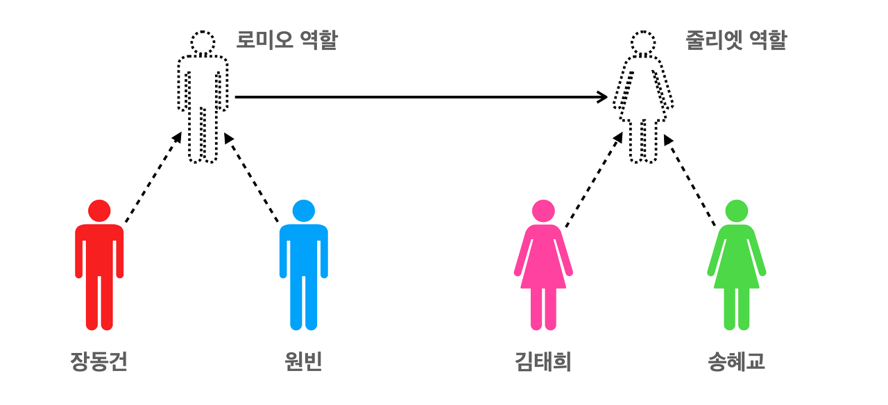

# 3주차 추가내용
## 객체
### 객체란?
- 사전적 정의: 실제 존재하는 것, 실생활에서 우리가 인식하는 것
- 프로그래밍에서의 객체: 클래스에 정의된 내용대로 메모리에 생성된 것
- 객체로는 함수, 배열, 정규 표현식이 있음

### 객체지향 프로그래밍 설명 예제: 로미오 줄리엣 공연 무대
  > 역할: 로미오 (실제 코드에서 생성자 함수)  
  > 구현: 배우 (실제 코드에서 인스턴스)

  - 역할(= 생성자 함수)은 고정되어 있지만 연기하는 배우(= 인스턴스)는 변할 수 있음.  
    but 배우가 바뀐다고 역할의 대사, 행동이 변하지는 않음
  - 프로그램으로 바꿔서 설명해보면, 인스턴스가 변경되어도 생성자 함수는 변하지 않는다는 의미

### 예시 코드
```Javascript
// Role: 생성자 함수 (Constructor) (객체(인스턴스)를 생성하는 함수)
function Role(romeo, juliet) {

    // romeo, juliet: 프로퍼티
    this.romeo = romeo;
    this.juliet = juliet;
    this.is = function() {
      console.log(`This is ${this.romeo} and ${this.juliet}!`); // Role {romeo: 'Actor', juliet: 'Actress', is: ƒ}
    };
  }

  // Actor, Actress: 인스턴스 (Instance)
  const actor = new Role('Actor', 'Actress'); 
  
  console.log(actor); // This is Actor and Actress!
  
  actor.is(); 
```
