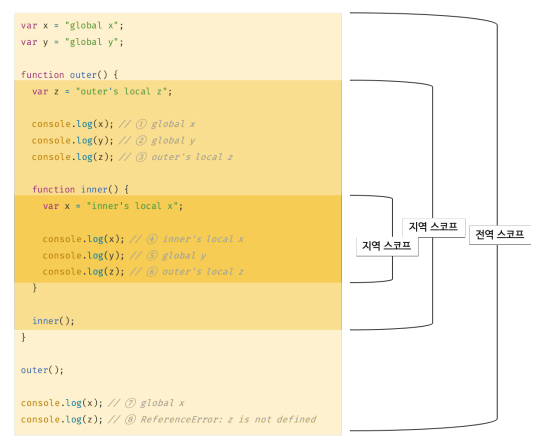
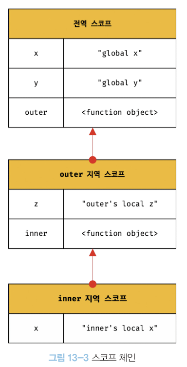

# 13. 스코프
## 스코프란?
- Scope 사전적 정의: 범위
- 자바스크립트에서의 Scope: 식별자가 유효한 범위
```javascript
function add(x, y) {
    // 매개변수 x, y는 함수 내부에서만 참조 가능
    // 매개변수의 스코프(유효범위)는 함수 몸체 내부다.
    console.log(x, y) // 2 5
    return x + y;
}

add(2, 5); 

// 매개변수는 함수 내부에서만 참조 가능
console.log(x, y); // ReferenceError: x is not defined
```
## 스코프의 종류


### 전역 스코프
- 위 예제에서 알 수 있듯이, 코드의 가장 바깥 영역(코드 전체에서 참조 가능)

### 지역 스코프
- 위 예제에서 알 수 있듯이, 함수 몸체 내부에서만 참조 가능

## 스코프 체인

- 스코프가 계층적으로 연결된 것
- 모든 스코프의 최상위 스코프는 전역 스코프임
- 상위 스코프에서 선언한 변수를 하위 스코프에서도 참조 가능

### 스코프 체인에 의한 변수 검색
```javascript
// funcion inner() 함수에서 변수 x의 선언을 검색하는 경우
// 4, 5, 6 번 각각의 변수가 참조하는 선언 부분은 어디일까?

var x = "global x";
var y = "global y";

// outer
function outer() {
    var z = "outer's local z";

    console.log(x); // 1 
    console.log(y); // 2
    console.log(z); // 3

    // inner()
    function inner() {
        var x = "inner's local x";

        // 4. 
        // inner 함수 내에 선언된 x 변수가 존재. 변수 참조 후 검색 종료
        console.log(x); 
        // 5. 
        // 전역 스코프에 y 변수의 선언 존재. 변수 참조 후 검색 종료
        console.log(y); 
        // 6. 
        // outer 함수에 z 변수의 선언이 존재. 변수 참조 후 검색 종료 
        console.log(z); 
    }
    inner();
}

outer();

console.log(x);
console.log(z);
```
- 변수 선언을 찾으면 바로 검색 종료 (x 변수를 찾으러 전역 스코프의 x 변수 선언까지 이동하지 않음)
#### 유의
- 상위 스코프에서 유효한 변수는 하위 스코프에서 참조 가능
- but 하위 스코프에서 유효한 변수는 상위 스코프에서 참조 불가능

### 스코프 체인에 의한 함수 검색
- 스코프 체인에 의한 변수 검색과 원리가 동일
```javascript
// 전역 함수
function foo() { // 전역 스코프
    console.log('global function foo');
}

function bar() { // outer()
    // 중첩 함수
    function foo() { // 앞에 봤던 inner() 함수라고 생각하면 쉬움
        console.log('local function foo');
    }
    foo() // ***
}

bar() // local function foo 출력됨
```

## 함수 레벨 스코프
- 함수 몸체로 선언된 변수는 오로지 함수의 코드 블록(함수 몸체)만 지역 스코프로 인정함
```javascript
var x = 1;

// 함수 뿐 아니라 모든 코드 블록(if, for, while, try/catch)이 지역 스코프를 만듬
// => 블록 레벨 스코프
if(true) {
    // x 변수가 중복 선언됨. 변수(x)의 값이 변경됨
    var x = 10;
}

console.log(x) //10
```
```javascript
var i = 10;

// 변수의 중복 선언
for(var i = 0; i < 5; i++) {
    console.log(i); // 0 1 2 3 4
}

// var 키워드로 선언된 변수는 블록 레벨 스코프 인정하지 않음
// let, const 블록 레벨 스코프 지원함

// 현재 아래 i는 전역 변수의 값이 재할당된 상태
console.log(i) // 5
```
## 렉시컬 스코프 
- 렉시컬 사전적 의미: 어휘의.
- 사전을 찾아볼 때, 사전에 정의된 의미를 따라 문장의 의미를 파악함
- 렉시컬 스코프: 중첩된 함수 그룹에서 내부 함수가 상위 범위의 변수에 액세스 할 수 있음을 의미하는 말

```javascript
var x = 1;

function foo() {
    var x = 10;
    bar();
}

function bar() {
    console.log(x);
}

// 함수 호출이 아니라 함수 선언을 기준으로 스코프가 결정됨
// 아래 1 모두 bar() 선언문에서 참조한 전역 변수 x의 값이 출력됨
// = 렉시컬한 환경을 기준으로 bar 함수의 변수 스코프 객체에 정의된 x를 먼저 이용한다
// 즉 위에서 말한 사전에 정의된 의미 == 함수 선언
foo(); // 1 
bar(); // 1 
```
