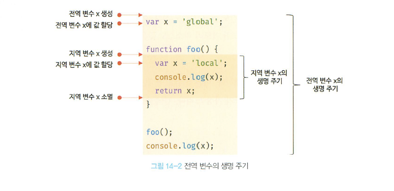

# 14. 전역 변수의 문제점
## 변수의 생명 주기
### 지역 변수의 생명 주기

- 지역 변수의 생명 주기는 함수의 생명 주기와 일치한다.
```javascript
function foo() {
    var x = 'local';
    console.log(x);
    return x;
}

foo();
console.log(x); // ReferenceError: x is not defined
```
### 전역 변수의 생명 주기

- 전역 변수의 생명주기는 전역 객체의 생명주기와 일치한다.
  - 전역 객체: 코드 실행 이전 엔진에 의해 먼저 생성되는 특수한 객체

## 전역 변수의 문제점
- 암묵적 결합
  - 변수의 유효 범위가 클수록 코드의 가독성은 나빠지고 의도치 않게 상태가 변경될 위험성 존재함
- 긴 생명 주기
  - 전역변수는 생명 주기가 길다
  - var 키워드를 사용할 경우, 변수 이름 중복 가능성도 존재함 (의도치 않은 재할당)
```javascript
var x = 1;

var x = 100; // 변수 중복 선언. 기존 변수에 값 재할당
console.log(x); // 100
```
- 스코프 체인 상에서 종점에 존재  
  - 전역 변수의 검색 속도가 가장 느림
- 네임스페이스 오염
  - 자바스크립트는 파일이 분리된 상태여도 하나의 전역 스코프를 공유함
  - 다른 파일 내에서 동일한 이름으로 명명된 전역 변수가 같은 스코프 내에 존재할 경우 문제 생김
## 전역 변수의 사용을 억제하는 방법
### 즉시 실행 함수
- 모든 코드를 즉시 실행 함수로 바꾸면 모든 변수는 즉시 실행 함수의 지역 변수가 됨
```javascript
(function () {
    var foo = 10;
}())

console.log(foo);
```
### 네임스페이스 객체
- 네임스페이스 역할 담당할 객체를 생성하고
- 전역 변수처럼 사용하고 싶은 변수를 프로퍼티에 추가함.
> 네임스페이스
> - 개체를 구분할 수 있는 범위
> - 일반적으로 하나의 이름 공간에서는 하나의 이름이 단 하나의 개체만을 가리킴

```javascript
var MYAPP = {}; // 전역 네임스페이스 객체
MYAPP.name = 'Lee'; // 전역 변수처럼 사용
console.log(MYAPP.name);
```
### 모듈 패턴
- 관련이 있는 변수, 함수를 모아 즉시 실행 함수로 감싸 하나의 모듈을 만든 것
```javascript
var Counter = (function() {

  // private
    var num = 0;

  // public
    return {
        increase() {
            return ++num;
        },
        decrease() {
            return --num;
        }
    }
}());

console.log(Counter.num); // undefined. num은 private

console.log(Counter.increase); // 1
console.log(Counter.increase); // 2
console.log(Counter.decrease); // 1
console.log(Counter.decrease); // 0
```

### ES6 모듈
- ES6에서 파일 자체의 독자적인 모듈 스코프 제공
- 48, 49장 참고
```javascript
<script type="module" src="lib.mjs"></script>  
<script type="module" src="app.mjs"></script>
```
