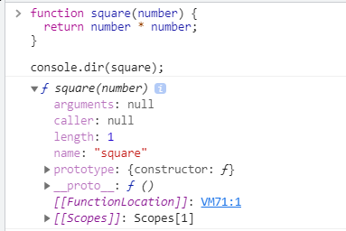

# 18. 함수와 일급객체
## 일급객체
- 무명의 리터럴로 생성 가능하다. 즉, 런타임에 생성이 가능하다.
- 변수나 자료구조(객체, 배열)에 저장할 수 있다.
- 함수의 매개변수에 전달할 수 있다.
- 함수의 반환값으로 사용할 수 있다.

## 함수 객체의 프로퍼티
```javascript
function square(number) {
    return number * number;
}

console.dir(square);
```


#### 함수 객체의 프로퍼티 어트리뷰트
```javascript
function square(number) {
    return number * number;
}

console.log(Object.getOwnPropertyDescriptors(square));
/*
arguments: {value: null, writable: false, enumerable: false, configurable: false}
caller: {value: null, writable: false, enumerable: false, configurable: false}
length: {value: 1, writable: false, enumerable: false, configurable: true}
name: {value: 'square', writable: false, enumerable: false, configurable: true}
prototype: {value: {…}, writable: true, enumerable: false, configurable: false}
[[Prototype]]: Object
*/
console.log(Object.getOwnPropertyDescriptor(square)); // undefined
```
### arguments 프로퍼티
- 함수 호출 시 전달된 인수들의 정보를 담고 있는 순회 가능한 유사배열객체
- 지역변수처럼 사용함
```javascript
function multiply(x, y) {
    console.log(arguments);
    return x + y;
}

console.log(multiply()); // NaN
console.log(multiply(1)); // NaN
console.log(multiply(1, 2)); // 2
console.log(multiply(1, 2, 3)); // 2 
```

### caller 프로퍼티
- ECMAScript 사양에 포함되지 않은 비표준 프로퍼티임
- caller 프로퍼티는 함수 자신을 호출한 함수를 가리킴
```javascript
function foo(func) {
    return func();
}

function bar() {
    return 'caller: ' + bar.caller;
}

// 브라우저에서 실행한 결과
console.log(foo(bar)); 
/*
caller: function foo(func) {
  return func();
}
*/

console.log(bar()); // caller: null
```
### length 프로퍼티
- 함수를 정의할 때 선언한 매개변수의 개수를 가리킴
```javascript
function foo() {}
console.log(foo.length); // 0 (선언한 매개변수 없음)

function bar(x) {
    return x;
}
console.log(bar.length); // 1 (x)

function baz(x, y) {
    return x * y;
}
console.log(baz.length);  // 2 (x, y)
```
### name 프로퍼티
- 함수이름을 나타냄
- ES5, ES6에서의 차이점
  - ES5: 익명 함수 표현식의 경우 name 프로퍼티는 빈 문자열을 값으로 가짐
  - ES6: 함수객체를 가리키는 식별자를 값으로 가짐
```javascript
// 기명 함수 표현식
var namedFunc = function foo() {};
console.log(namedFunc.name) // foo

// 익명 함수 표현식
var anonymousFunc = function() {}; // function 뒤에 함수 이름이 없음

console.log(anonymousFunc.name); // anonymousFunc (함수객체를 가리키는 식별자)

// 함수 선언문
function bar() {}
console.log(bar.name); // bar
```
### __proto__접근자 프로퍼티
- 모든 객체는 [[prototype]]이라는 내부슬롯을 가짐
- 내부슬롯이란? 객체지향 프로그래밍의 상속을 구현하는 프로토타입 객체(19단원)를 가리킴
```javascript
const obj = { a: 1 };

console.log(obj.__proto__ === Object.prototype); // true

console.log(obj.hasOwnProperty('a')); // true
console.log(obj.hasOwnProperty('__proto__')); // false
```
### prototype 프로퍼티
- 생성자 함수로 호출 가능한 객체만 소유하는 프로퍼티
```javascript
(function () {}).hasOwnProperty('prototype'); // true

({}).hasOwnProperty('protytype'); // false
```