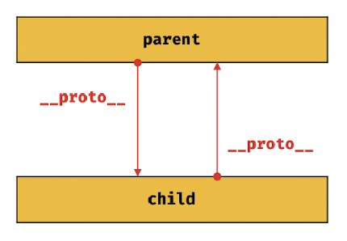

# 19. 프로토타입
## 객체지향 프로그래밍
- 객체(독립적 단위)의 집합으로 프로그램을 표현하는 패러다임
- 속성(attribute)이란? 특징, 성질 (JS에서의 프로퍼티를 의미함.)
- 추상화란? 프로그램에 필요한 속성만 간추려내어 표현하는 것  
  (= 복잡함 속에서 필요한 관점만 추출하는 행위. 프로그램 = 소프트웨어 추상화한 것)
  - 비유: 지하철 노선도는 현실 지도의 복잡함을 간추려내어 나타낸 것. (디자인의 추상화)  
  (역 간 거리, 실제 위치 상관없이 오로지 지하철 탑승자의 관심사만을 반영하고 있음)
  

## 상속과 프로토타입
- 프로토타입(prototype)이란? 
  - 부모에게 물려받은 유전자라고 생각하면 쉬움
  - 비유하자면.. 유전자: 프로토타입, 유전자 정보: 프로퍼티, 메서드
- 상속이란? 객체의 프로퍼티, 메서드를 타 객체가 그대로 사용 가능하게 하는 것
  - = 유전자 정보(프로퍼티, 메서드)을 자식(타 객체)에게 물려주는 것
- 자바스크립트는 프로토타입 기반으로 상속을 구현한다
  - = 기존의 객체를 복사하여 새로운 객체를 생성한다 
> 
```javascript
function Circle(radius) {
    this.radius = radius;
}

// getArea 메서드를 Circle 프로토타입에 추가한 상황
// 프로토타입은 Circle 생성자 함수의 protptype 프로퍼티에 바인딩되어 있다.
Circle.prototype.getArea = function(){
    return Math.PI * this.radius ** 2;
}

// 인스턴스 생성
// 여기서 circle1, circle2가 Circle 생성자 함수의 프로토타입을 상속받은 것
const circle1 = new Circle(1);
const circle2 = new Circle(2);

// Circle 생성자 함수가 생성한 모든 인스턴스는 
// 부모 객체의 역할을 하는 프로토타입 Circle.prototype으로부터 getArea 메서드 상속받음
console.log(circle1.getArea === circle2.getArea); // true

console.log(circle1.getArea()); // 3.141592653589793
console.log(circle2.getArea()); // 12.566370614359172
```
## 프로토타입 객체
### __proto__접근자 프로퍼티
- 접근자 프로퍼티란? 특정 객체의 프로퍼티 값을 객체 바깥에서 사용 가능하도록 한 메서드
- __proto__는 접근자 프로퍼티다
  - 직접 [[Prototype]] 내부 슬롯에 접근은 불가능하고, 
  - __proto__접근자 프로퍼티를 통해 간접적으로 내부 슬롯의 값(프로토타입)에 접근 가능
- __proto__접근자 프로퍼티는 상속을 통해 사용된다
  - __proto__접근자 프로퍼티는 객체가 직접 소유하는 프로퍼티가 아니라 Object.Prototype의 프로퍼티임
  - 모든 객체는 상속을 통해 Object.prototype.__proto__접근자 프로퍼티를 사용 가능함
- __proto__접근자 프로퍼티를 통해 프로토타입에 접근하는 이유
  - 상호 참조에 의한 프로토타입 체인 생성을 방지하기 위해
  - 상호 참조란? 서로가 자신의 프로토타입이 되는 프로토타입 체인이 만들어지는 것  
    (프로토타입 체인이 만들어지면, __proto__접근자 프로퍼티는 에러 발생시킴)  

- __proto__접근자 프로퍼티를 코드 내에서 직접 사용하는 것을 권장하지 않는다.
  - 모든 객체가 __proto__접근자 프로퍼티를 사용할 수 있는 것은 아니기에.

### 함수 객체의 prototype 프로퍼티
- 생성자 함수가 생성할 인스턴스의 프로토타입을 가리킴
- __proto__접근자 프로퍼티/prototype 프로퍼티는 동일한 프로토타입이지만, 사용주체는 다름
 
 ```javascript
// 생성자 함수
function Person(name){
  this.name = name;
}

const me = new Person('Lee');

console.log(me.prototype === me.__proto__); //true
```

### 프로토타입의 constructor 프로퍼티와 생성자 함수
- 모든 프로토타입은 constructor 프로퍼티를 가짐
- constructor 프로퍼티: prototype 프로퍼티로 자신을 참조하고 있는 생성자 함수
```javascript
// 생성자 함수
function Person(name){
  this.name = name;
}

const me = new Person('Lee');

// me 객체는 프로토타입인 Person.prototype의 constructor 프로퍼티를 상속받아 사용함.
console.log(me.constructor === Person); //true
```
## 리터럴 표기법에 의해 생성된 객체의 생성자 함수와 프로토타입
- 리터럴 표기법에 의해 생성된 객체의 경우,  
  객체의 생성자 함수는 Object 생성자 함수임.
```javascript
// obj 객체는 Object 생성자 함수로 생성한 객체가 아니라 객체 리터럴로 생성함
const obj = {};

// 하지만 obj 객체의 생성자 함수는 Object 생성자 함수
console.log(obj.constructor === Object); //true
```
## 프로토타입의 생성 시점
- 프로토타입은 생성자 함수가 생성되는 시점에 더불어 생성됨

### 사용자 정의 생성자 함수와 프로토타입 생성 시점
```Javascript
// constructor가 평가되어 함수 객체를 생성하는 시점에 프로토타입도 더불어 생성됨
console.log(Person.prototype); // { constructor: f }

// 생성자 함수
function Person(name) {
  this.name = name;
}
```
```Javascript
// 화살표 함수는 non-constructor다.
function Person(name) => {
  this.name = name;
};

// non-constructor는 프로토타입이 생성되지 않는다.
console.log(Person.prototype); // undefined
```
### 빌트인 생성자 함수와 프로토타입 생성 시점
- 빌트인 생성자 함수: Object, String, Number, Function, Array, RegExp, Date, Promise  
  (빌트인 객체: ECMAScript 사양에 정의된 객체)
- 모든 빌트인 생성자 함수는 전역 객체가 생성되는 시점에 생성된다. 
- 생성된 프로토타입은 빌트인 생성자 함수의 prototype 프로퍼티에 바인딩된다.

## 객체 생성 방식과 프로토타입의 결정
- 객체 생성 방식
  - 객체 리터럴
  - Object 생성자 함수
  - 생성자 함수
  - Object.create 메서드
  - 클래스(ES6)
> 추상 연산 OrdinaryObjectCreate에 의해 생성된다는 공통점 가짐

### 객체 리터럴과 Object 생성자 함수에 의한 객체 생성 방식의 차이?
- 프로퍼티 추가하는 방식이 다름
  - 객체 리터럴: 객체 리터럴 내부에 프로퍼티를 추가함
  - Object 생성자 함수: 빈 객체 생성 이후 프로퍼티 추가함
- 두 객체 생성 방식 모두 Object.prototype을 상속받음

## 프로토타입 체인
- 내부 슬롯의 참조를 따라 자신의 부모 역할을 하는 프로토타입의 프로퍼티를 순차적으로 검색하는 것
- 모든 프로토타입 체이닝의 종점은 Object.prototype

```javascript
function Person(name) {
  this.name = name;
}

// 생성자 함수 Person의 프로토타입 메서드 sayHello
Person.prototype.sayHello = function() {
  console.log(`Hi! My name is ${this.name}`);
}

const me = new Person('YJ');

// hasOwnProperty는 Object.prototype의 메서드
// me 객체는 프로토타입 체인을 따라 hasOwnProperty 메서드를 검색하여 사용 함
console.log(me.hasOwnProperty('name'));
me.hasOwnProperty('name'); // true
```

## 오버라이딩과 프로퍼티 섀도잉
### 오버라이딩
- 상위 클래스가 가지고 있는 메서드를 하위 클래스가 재정의하여 사용하는 방식
### 프로퍼티 섀도잉
- 상속 관계에 의해 프로퍼티가 가려지는 현상 (아래 코드에 자세한 설명)
```javascript
const Person = (function(){
  // 생성자 함수
  function Person(name) {
    this.name = name;
  }

  // 프로토타입 메서드
  Person.prototype.sayHello = function() {
    console.log(`Hi! My name is ${this.name}`);
  };

  // 생성자 함수를 반환
  return Person;
}());

const me = new Person('YJ');

// 인스턴스에 메서드를 추가함.
// 인스턴스 메서드 sayHello는 프로토타입 메서드 sayHello를 오버라이딩 한 것.
me.sayHello = function() {
  console.log(`Hey! My name is ${this.name}`);
};

// 인스턴스 메서드가 호출된다. 
// 프로토타입 메서드는 인스턴스 메서드에 의해 가려진다.
// 프로퍼티 섀도잉: 상속 관계에 의해 프로퍼티가 가려지는 현상 (= 해당 코드에서 프로토타입 메서드가 가려지는 현상)
me.sayHello(); // Hey! My name is YJ 
```
### 프로퍼티 삭제
- 프로토타입 프로퍼티를 변경 또는 삭제하려면 하위 객체를 통해 프로토타입 체인으로 접근하는 것이 아니라 프로토타입에 직접 접근해야 함

## 프로토타입의 교체
### 생성자 함수에 의한 프로토타입의 교체
```javascript
const Person = (function(){
  function Person(name){
    this.name = name;
  }
  
  // 생성자 함수의 prototype 프로퍼티를 통해 프로토타입을 교체
  Person.prototype = {
    sayHello() {
      console.log(`Hi! My name is ${this.name}`);
    }
  };
  
  return Person;
}());

const me = new Person('Yejin');
```
```javascript
const Person = (function(){
  function Person(name){
    this.name = name;
  }
  
  // 생성자 함수의 prototype 프로퍼티를 통해 프로토타입을 교체
  Person.prototype = {
   // constructor 프로퍼티와 생성자 함수 간의 연결을 설정
    constructor : Person,
    sayHello() {
      console.log(`Hi! My name is ${this.name}`);
    }
  };
  
  return Person;
}());

const me = new Person('Yejin');

console.log(me.constructor === Person); // true
console.log(me.constructor === Object); // false
```
### 인스턴스에 의한 프로토타입의 교체
- __proto__접근자 프로퍼티를 통해 접근하는 것
```Javascript
function Person(name) {
  this.name = name;
}

const me = new Person('YJ');

// 프로토타입으로 교체할 객체
const parent = {
  sayHello() {
    console.log(`Hi! My name is ${this.name}`);
  }
};

// me.__proto__ = parent;와 동일하게 동작함
Object.setPrototypeOf(me, parent);

me.sayHello();
```

## instanceof 연산자
- 생성자 함수의 prototype에 바인딩된 객체가 프로토타입 체인 상에 존재하는지 확인해주는 것
```javascript
function Person(name) {
  this.name = name;
}

const me = new Person('YJ');

console.log(me instanceof Person); // true. Person.prototype이 me 객체의 프로토타입 체인 상에 존재함.
console.log(me instanceof Object); // true. Object.prototype이 me 객체의 프로토타입 체인 상에 존재함.
```
## 직접 상속
### Object.create에 의한 직접 상속
- Object.create 메서드는 명시적으로 프로토타입을 지정하여 새로운 객체를 생성
```javascript
// obj -> null. (프로토타입이 null인 객체)
let obj = Object.create(null); // 새로운 객체 생성함
console.log(Object.getPrototypeof(obj) === null); // true
console.log(obj.toString()); // false. Object.prototype을 상속받지 못했음

// obj -> Object.protptype -> null
// obj = {};
obj = Object.create(Object.prototype);
console.log(Object.getPrototypeOf(obj) === Object.prototype); // true
```
### 객체 리터럴 내부에서 __proto__에 의한 직접 상속
```Javascript
const myProto = {x:10};

// obj 객체 리터럴에 의해 객체를 생성하며 프로토타입을 지정하여 직접 상속할 수 있다
const obj = {
  y: 20,

  // 객체를 직접 상속받음
  // obj -> myProto -> Object.prototype -> null
  __proto__: myProto
};

console.log(obj.x, obj.y); // 10 20
console.log(Object.getPrototypeOf(obj) === myProto); //true
```

## 정적 프로퍼티/메서드
- 생성자 함수로 인스턴스를 생성하지 않아도 참조/호출 가능한 프로퍼티/메서드
```javascript
function Person(name) {
  this.name = name;
}

// 프로토타입 메서드
Person.prototype.Hello = function() {
  console.log(`Hi! My name is ${this.name}`);
}

// 정적 프로퍼티
Person.staticProp = 'static prop';

// 정적 메서드
Person.staticMethod = function(){
  console.log('staticMethod');
}

// 생성자 함수가 생성한 인스턴스
const me = new Person('YJ');

// 생성자 함수에 추가한 정적 프로퍼티/메서드는 생성자 함수로 참조/호출한다.
Person.staticMethod(); // staticMethod 출력됨

// 정적 프로퍼티/메서드는 생성자 함수가 생성한 인스턴스로 참조/호출할 수 있다.
me.staticMethod(); // TypeError: me.staticMethod is not a function
```
## 프로퍼티 존재 확인
- in 연산자 혹은 Object.prototype.hasOwnProperty 메서드 사용
```javascript
// in 연산자 사용
const person = {
  name: 'Lee',
  address: 'Seoul'
}

// person 객체에 name 프로퍼티가 존재함
console.log('name' in person) // true
```
```javascript
// Object.prototype.hasOwnProperty 메서드 사용
const person = {
  name: 'Lee',
  address: 'Seoul'
}

// person 객체에 name 프로퍼티가 존재함
console.log(person.hasOwnProperty('name')) // true
```
## 프로퍼티 열거
- for ... in문
- 객체의 모든 프로퍼티를 순회하며 열거하려면 위 반복문 사용함
- 프로퍼티 어트리뷰트 [[Enumerable]] 값이 true인 프로퍼티를 순회하며 열거한다.
```javascript
const person = {
  name: 'Lee',
  address: 'Seoul'
}

for(const key in person){
  console.log(key + ': ' + person[key]);
}

// name: Lee
// address: Seoul
```
