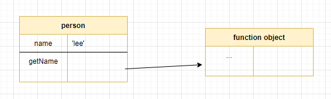

# 22. this
## this 키워드
- 자신이 속한 객체의 프로퍼티를 참조하려면,  
  자신이 속한 객체를 가리키는 식별자를 참조할 수 있어야 함
```javascript
// 객체 리터럴 방식
const circle = {
  // 프로퍼티: 고유의 상태 데이터
  radius: 5,

  // 메서드: 상태 데이터를 참조하고 조작하는 동작
  // this는 메서드를 호출한 객체(circle)을 가리킨다. (radius 가리키는 것 아님)
  getDiameter() {
    return 2 * this.radius; // 10
  }
}

console.log(circle.getDiameter());
```
```javascript
// 생성자 함수 방식
function Circle(radius) {
  // this는 생성자 함수가 생성할 인스턴스를 가리킨다.
  this.radius = radius;
}

Circle.prototype.getDiameter = function() {
  // this는 생성자 함수가 생성할 인스턴스를 가리킨다.
  return 2 * this.radius;
}

// 인스턴스 생성(circle 변수)
const circle = new Circle(5);
console.log(circle.getDiameter()); // 10
```
## 함수 호출 방식과 this 바인딩
### 일반 함수 호출
- this에는 전역 객체가 바인딩된다.
- (20단원) 'use strict' 사용 시 this에는 undefined가 할당된다.
```javascript
function foo() {
  console.log("foo: ", this); // window (브라우저 기준)
  // global {global: global, queueMicrotask: ƒ, clearImmediate: ƒ, setImmediate: ƒ, structuredClone: ƒ, …} (node.js 기준)

  function bar() {
    console.log("bar: ", this); // window
  }
  bar();
}
foo();
```
### 메서드 호출
- 메서드를 호출한 객체에 바인딩 됨
- 메서드는 객체에 포함된 것이 아니라 독립적으로 존재하는 별도의 객체임

```javascript
const person {
  name: 'yejin';
  getName() {
    return this.name;
  }
}

// 메서드 getName을 호출한 객체는 person이다.
console.log(person.getName()); // yejin
```
### 생성자 함수 호출
- 생성자 함수 내부의 this에는 생성자 함수가 (미래에) 생성할 인스턴스가 바인딩된다.
```javascript
function Circle(radius) {
  // 생성자 내부 함수의 this는 생성자 함수가 생성할 인스턴스를 가리킨다
  this.radius = radius;
  this.getDiameter = function() {
    return 2 * this.radius;
  };
}

const circle1 = new Circle(5);
const circle2 = new Circle(10);

console.log(circle1.getDiameter()); // 10
console.log(circle2.getDiameter()); // 20
```
### Function.prototype.apply/call/bind 메서드에 의한 간접 호출
- apply, call 메서드의 본질적인 기능은 함수를 호출하는 것
```javascript
// 예시1. 함수호출
function getThisBinding() {
  return this;
}

// this로 사용할 객체
const thisArg = { a: 1 };

console.log(getThisBinding());

// apply, call: getThisBinding 함수를 호출함.
console.log(getThisBinding.apply(thisArg)); // {a: 1}
console.log(getThisBinding.call(thisArg)); // {a: 1}

// bind
console.log(getThisBinding.bind(thisArg)); // getThisBinding()

// bind 메서드는 함수를 호출하지는 않음. 명시적으로 호출해야 함
console.log(getThisBinding.bind(thisArg)()); // {a: 1}
```
```javascript
// 예시2. 인수호출 방식의 차이
function getThisBinding() {
  return this;
}

// this로 사용할 객체
const thisArg = { a: 1 };

console.log(getThisBinding());

// apply. 인수를 배열로 묶어 전달함.
console.log(getThisBinding.apply(thisArg, [1, 2, 3])); 

// call. 인수를 쉼표로 구분한 리스트 형식으로 전달
console.log(getThisBinding.call(thisArg, 1, 2, 3)); 
```
## 정리
|함수 호출 방식|this 바인딩|
|:-:|:-:|
|일반함수 호출|전역 객체|
|메서드 호출|메서드를 호출한 객체|
|생성자 함수 호출|생성자 함수가 (미래에) 생성할 인스턴스|
|Function.prototype.apply/call/bind 메서드에 의한 간접 호출|Function.prototype.apply/call/bind 메서드에 첫 번째 인수로 전달한 객체|