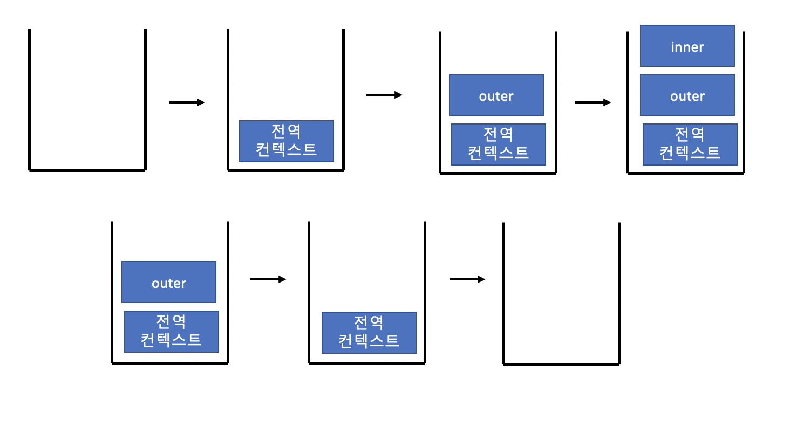
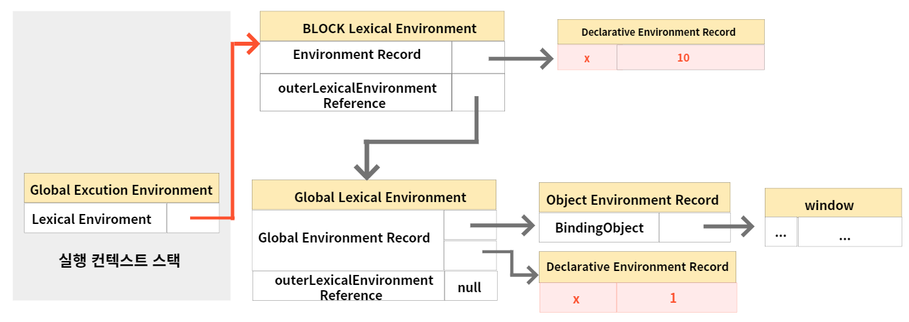

# 23. 실행 컨텍스트
- 1, 2장의 소스코드 타입, 평가 부분은   
  실행 컨텍스트의 개념 + 소스코드의 타입/평가/실행 이 개념들을 동시에 생각해야 하다 보니  
  더 혼란스러워져서 생략했다.
- 해당 장에서는 '실행 컨텍스트' 부분만 다루겠다.
## 실행 컨택스트란?
- 실행할 코드에 제공할 '환경 정보'들을 모아놓은 객체

## 실행 컨텍스트의 역할 (코드 평가/실행과정)
- 코드 평가/실행과정을 자세히 다루기보다는, 이런 과정이 있다 정도만 알아두겠다.
1. 전역 코드 평가
   - 전역 코드를 실행하기 위한 준비 단계이다.
2. 전역 코드 실행
   - 런타임이 시작되어 전역 코드가 순차적으로 실행되기 시작하는 단계이다.
3. 함수 코드 평가
   - 함수 호출에 의해 코드 실행 순서가 변경되어 함수 내부로 진입하고,
   - 함수 내부 문을 실행하기에 앞서 함수 코드 평가 과정을 통해 실행 준비를 한다.
4. 함수 코드 실행
   - 평가 과정 종료 후, 런타임이 시작되어 함수 코드가 순차적으로 실행되기 시작하는 단계이다.
## 실행 컨텍스트 스택
- 실행 컨텍스트는 스택 자료구조로 관리됨

1. 전역 코드의 평가와 실행
2. outer 함수 코드의 평가와 실행
3. inner 함수 코드의 평가와 실행
4. outer 함수 코드로 복귀
5. 전역 코드로 복귀
> 실행 컨텍스트 스택의 코드의 실행 순서를 관리한다.  
> 실행 컨텍스트 최상위에 존재하는 실행 컨텍스트를 '실행 중인 실행 컨텍스트'라 부른다.
## 렉시컬 환경
### 렉시컬 환경은 다음과 같이 두 개의 컴포넌트로 구성됨
### 환경 레코드
- 스코프에 포함된 식별자를 등록하고 등록된 식별자에 바인딩된 값을 관리하는 저장소
### 외부 렉시컬 환경에 대한 참조
- 외부 렉시컬 환경에 대한 참조는 상위 스코프를 가리킨다.
  - 상위 스코프: 해당 실행 컨텍스트 생성한 소스코드를 포함하는 상위 코드와 렉시컬 환경을 말한다. 
  - 외부 렉시컬 환경에 대한 참조를 통해 단방향 링크드 리스트인 스코프 체인을 구현함
## 아래 예시 코드의 실행 컨텍스트의 생성과 식별자 검색 과정
```javascript
var x = 1;
const y = 2;

function foo(a) {
    var x = 3;
    const y = 4;

    function bar(b) {
        const z = 5;
        console.log(a + b + x + y + z);
    }
    bar(10);
}
foo(20); // 42
```
### 전역 객체 생성
### 전역 코드 평가
#### 1. 전역 실행 컨텍스트 생성
- 전역 실행 컨텍스트를 생성하여 실행 컨텍스트 스택에 푸시한다.
#### 2. 전역 렉시컬 환경 생성
- 전역 렉시컬 환경을 생성하고 전역 실행 컨텍스트에 바인딩한다.
#### 2-1. 전역 환경 레코드 생성
- var 키워드로 선언한 전역 변수는 이 곳에 등록되고 관리 됨
- (전역 변수를 관리하는 전역 스코프, 빌트인 전역 프로퍼티, 빌트인 전역 함수, 표준 빌트인 객체를 제공함)
#### 2-1-1. 객체 환경 레코드 생성
- BindingObject는 '전역 객체 생성'에서 생성된 전역 객체다.
#### 2-1-2. 선언적 환경 레코드 생성
- let, const 키워드로 선언한 전역 변수(함수 표현식 포함)은 이 곳에 등록되고 관리됨.
#### 2-2. this 바인딩
- [[GlobalThisValue]] 내부 슬롯에 this가 바인딩됨
- 일반적으로 전역 코드에서 this는 전역 객체를 가리킴
#### 2-3. 외부 렉시컬 환경에 대한 참조 결정
- 현재 평가 중인 소스코드를 포함하는 외부 소스코드의 렉시컬 환경(상위 스코프) 가리킴
- 이를 통해 스코프 체인을 구현함.
### 전역 코드 실행
### foo 함수 코드 평가
#### 1. 함수 실행 컨텍스트 생성
#### 2. 함수 렉시컬 환경 생성
- foo 함수 렉시컬 환경을 생성하고 foo 함수 실행 컨텍스트에 바인딩한다.
#### 2-1. 함수 환경 레코드 생성
- 함수 환경 레코드는 매개변수, arguments 객체, 함수 내부에서 선언한 지역 변수와 중첩 함수를 등록하고 관리함
#### 2-2. this 바인딩
- [[ThisValue]] 내부 슬롯에 전역 객체가 바인딩됨
- 함수 환경 레코드의 [[ThisValue]] 내부 슬롯에 바인딩되어 있는 객체가 반환된다
#### 2-3. 외부 렉시컬 환경에 대한 참조 결정
- 현재 평가 중인 소스코드를 포함하는 외부 소스코드의 렉시컬 환경(상위 스코프) 가리킴
- foo 함수의 외부 렉시컬 환경에 대한 참조에는 전역 렉시컬 환경의 참조가 할당됨
### foo 함수 코드 실행
### bar 함수 코드 평가
- foo 함수 코드 평가와 동일함
### bar 함수 코드 실행
### bar 함수 코드 실행 종료
### foo 함수 코드 실행 종료
### 전역 함수 코드 실행 종료
## 실행 컨텍스트와 블록 레벨 스코프
```javascript
// let, const 키워드로 선언한 변수는 코드 블록을 지역 스코프로 인정하는 
// 블록 레벨 스코프를 따름
lex x = 1;

if(true) {
    let x = 10;
    console.log(x); // 10
}
console.log(x); // 1
```
- if문이 실행되면 새로운 렉시컬 환경을 생성하여 기존의 렉시컬 환경을 교체

- if문의 코드 블록을 위한 렉시컬 환경에서 이전 렉시컬 환경으로 복귀