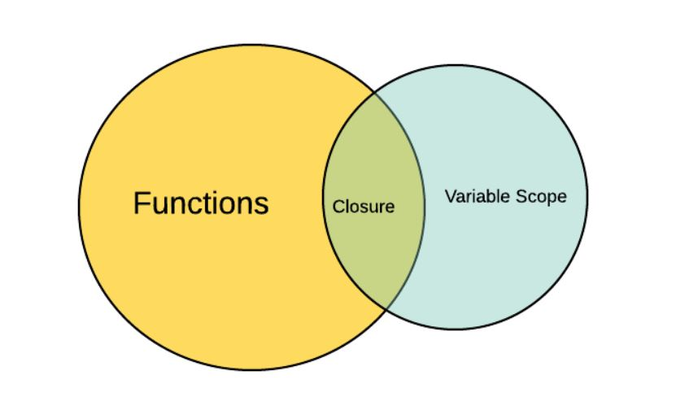
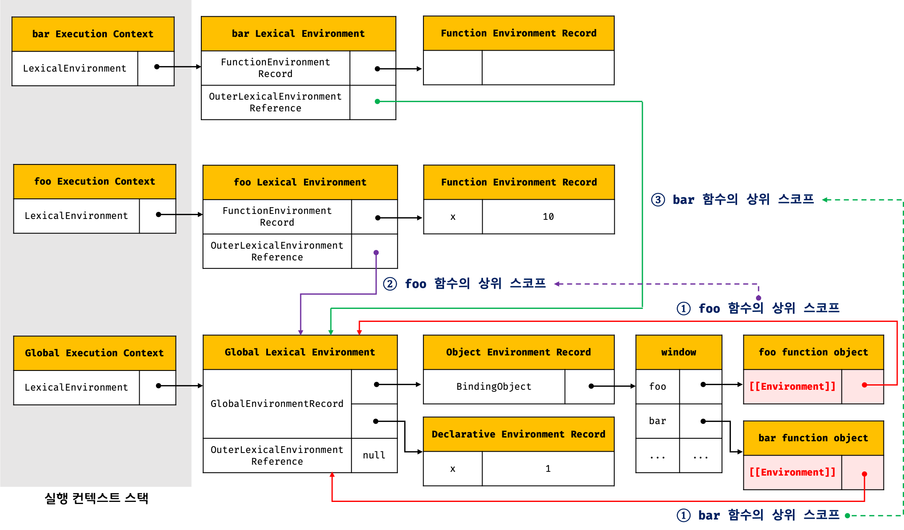

# 24. 클로저
## 클로저란?
> 클로저는 함수와 그 함수가 선언된 렉시컬 환경과의 조합이다

- 자신이 생성될 때의 환경을 기억하는 함수

```javascript
const x = 'Global';

function outerFunc(){
    const x = 'outerFunc(Local)';
    innerFunc();
}

function innerFunc() {
    console.log(x); // Global
}

outerFunc();

// 중첩 함수가 아니라면 innerFunc() 함수를 outerFunc() 함수의 내부에서 호출해도 
// outerFunc 함수의 변수에 접근 불가능
// 자바스크립트는 렉시컬 스코프를 따르기 때문.
```
## 렉시컬 스코프
- 함수 호출이 아닌 정의(선언)를 기준으로 상위 스코프를 결정함
```javascript
const name = 'YJ(global)';

function foo() {
    const name = 'YJ(local)';
    bar();
}

function bar() {
    console.log(name);
}

foo(); // YJ(global)
bar(); // YJ(global). 전역 name이 반환된 것임.
```
## 함수 객체의 내부 슬롯 [[Environment]]
- 함수는 자신의 내부 슬롯 [[Environment]]에 자신이 정의된 환경, 상위 스코프의 참조를 저장함

```javascript
const name = 'YJ(global)';

function foo() {
    const name = 'YJ(local)';

    // 상위 스코프는 함수 정의 환경(위치)에 따라 결정된다.
    // 함수 호출 위치와 상위 스코프는 아무 관계가 없다.
    bar();
}

function bar() {
    console.log(name);
}

// 함수 bar는 자신의 상위 스코프, 즉 전역 렉시컬 환경을 [[Environment]]에 저장하여 기억한다.
foo(); // YJ(global)
bar(); // YJ(global). 전역 name이 반환된 것임.
```
## 클로저와 렉시컬 환경
- 외부 함수보다 중첩 함수가 더 오래 유지되는 경우 중첩 함수는 이미 생명 주기 종료한 외부 함수의 변수를 참조 가능하다
```javascript
const x = 'Global';

function outer() {
    const x = 'Outer';
    const inner = function() {console.log(x);};
    return inner;
}

// outer 함수를 호출하면 중첩 함수 inner를 반환한다.
// outer 함수의 실행 컨텍스트는 실행 컨텍스트 스택에서 팝되어 제거된다
// 하지만, outer 함수의 렉시컬 환경까지 소멸하는 것은 아니다.
// outer 함수의 렉시컬 환경은 inner 함수의  [[Environment]] 내부 슬롯에 의해 참조되고 있다.
const innerFunc = outer();
innerFunc(); // Outer

// 클로저: 해당 코드에서 중첩 함수(inner)
```
> 클로저는 함수와 그 함수가 선언된 렉시컬 환경과의 조합이다  
> (렉시컬 환경: 상위 스코프를 의미함.)  
> 즉, 클로저는 함수와 함수가 선언된 상위 스코프와의 조합이다. (개인적인 해석)
## 클로저의 활용
```javascript
let num = 0;

const increase = function () {
    return ++num;
}

// 함수에 의해 의도치 않게 카운트 상태(전역 변수 num의 값)가 변경되면 오류로 이어짐.
console.log(increase()); // 1
console.log(increase()); // 2
console.log(increase()); // 3
```
```javascript
const increase = function () {
    let num = 0;

    return ++num;
}

// increase 함수 호출 시 지역 변수 num은 다시 선언되고, 0으로 초기화 됨
console.log(increase()); // 1
console.log(increase()); // 1
console.log(increase()); // 1
```
## 캡슐화와 정보 은닉
- 자바스크립트에서 객체의 모든 프로퍼티와 메서드는 기본적으로 public하다
- 하지만 let, const 키워드는 Person 생성자 함수의 지역변수임(외부 참조, 변경 불가능)
```javascript
function Person(name, age) {
  this.name = name; // Public
  let _age = age;  // private

  // 인스턴스 메서드
  this.Hi = function() {
      console.log(`Hi! My name is ${this.name}. I am ${_age}.`);
  };
}

const me = new Person('Yejin', 25); // Hi! My name is Yejin. I am 25.
me.Hi();
console.log(me.name); // Yejin
console.log(me._age); // undefined

const you = new Person('YJ', 26); // Hi! My name is YJ. I am 26.
you.Hi();
console.log(you.name); // YJ
console.log(you._age); // undefined
```
## 자주 발생하는 실수
- 잘못된 예시
```javascript
var funcs = [];

// var 키워드로 선언한 i 변수는 블록 레벨 스코프가 아닌 함수 레벨 스코프를 가짐. (= 전역변수임)
for(var i = 0; i < 3; i++) {
    // 전역 변수 i를 참조하여 i의 값 3이 출력됨
    funcs[i] = function() { return i; };
}

for(var j = 0; j < funcs.length; j++) {
    console.log(funcs[j]()); // 3 3 3 (3만 3번 출력되는 오류 발생함)
}
```
- 위 예시 올바르게 수정한 것
- 아래 예시처럼 사용해도 되지만, let/const 키워드 사용해도 위의 문제가 해결됨
```javascript
var funcs = [];

for(var i = 0; i < 3; i++) {
    funcs[i] = (function(id) { 
        return function() {
            return id;
        };
    }(i));
}

for(var j = 0; j < funcs.length; j++) {
    console.log(funcs[j]()); // 0 1 2
}
```
