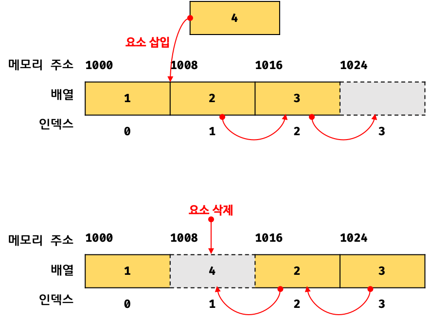
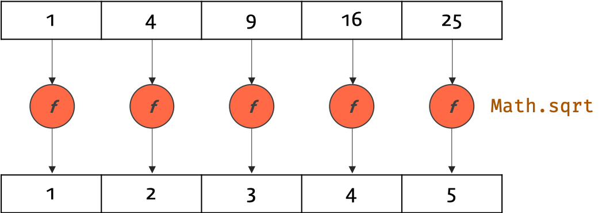
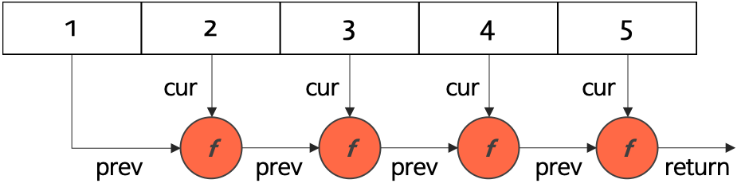

# 27. 배열
## 자바스크립트 배열은 배열이 아니다.
### 일반적인 배열

- 동일한 크기의 메모리 공간이 연속으로 나열된 자료구조
- 인덱스로 접근 가능
### 자바스크립트의 배열

- 각 요소의 메모리 공간이 동일하지 않아도 됨
- 각 요소의 메모리 공간이 연속적이지 않을 수 있음
- 해시 테이블로 구현된 객체임
> 자바스크립트의 배열은 일반적인 배열의 동작을 흉내 낸 특수한 객체다.

## length 프로퍼티와 희소 배열
- length 프로퍼티 값은 0 ~ 2^(32-1) 사이의 양의 정수 값을 갖는다.
```Javascript
const arr = [1, 2];
arr.length; // 3

arr.push(3);
arr.length; // 3

arr.pop(); // 가장 마지막 인덱스가 삭제됨
arr.length; // 2
console.log(arr); // [1, 2]
```
- 현재 배열의 길이보다 작은 length를 할당하면 새로운 length에 맞게 배열이 줄어들음
- length 프로퍼티의 값은 바뀌지만 실제 배열에는 변화가 없음
```Javascript
const arr = [1,2,3,4,5];
arr.length = 2;
arr; // [1,2]
```
- 희소 배열
```Javascript
const arr = [1, , 3, , 5];
arr.length; // 5
console.log(arr); // [1, …, 3, …, 5]
```
## 배열 생성
### 배열 리터럴
- 배열 리터럴을 한 줄로 정의하자면? (복습)
  - 배열을 할당받은 변수에 넣는 변하지 않는 데이터
```Javascript
const arr = [1, 2, 3];
const arr2 = [];
const arr3 = [1, , 3];
arr3[1] // undefined. arr3 객체의 1번 인덱스에 할당된 프로퍼티 값이 없음
console.log(arr3[0]);  // 1
```
### 배열 선언 시 키워드로 올 수 있는 것?
- 배열 파트에서는 특이하게 예제가 주로 var가 아닌 const로 쓰여져있길래 궁금해서 검색해봤다.
> var, let, const 모두 선언가능하다고 한다.

### 하지만 const 키워드 배열(혹은 함수나 객체)을 주로 사용하는 이유는?
- 선언된 배열, 객체, 함수 등의 값이 재할당되는 것을 막기 위함이라고 한다.
### [const 배열의 사용 이유](https://www.hanumoka.net/2018/09/21/javascript-20180921-javascript-var-let-const/)
```javascript
const arr = function(){
  ...
};

const arr = "yejin";   // 에러 발생
```
<br>

### Array 생성자 함수 사용한 호출
```Javascript
// 인수가 1개이면 length 프로퍼티가 인수인 배열을 생성함.
// 요소가 1개인 것이 아님.
const arr = new Array(10); // 요소는 없고 arr.length만 10
console.log(arr.length); 

// 인수가 없으면 빈 배열 생성(배열 리터럴과 동일)
// 인수가 2개 이상, 숫자가 아니면 그 인수를 요소로 갖는 배열을 생성
const arr = new Array(1,2,3); // [1,2,3]
const arr2 = new Array('apple'); // ['apple']
```
### Array.of
```Javascript
// 전달된 인수를 요소로 갖는 배열 생성

Array.of(1); // [1]
Array.of('apple'); // ['apple']
Arrray.of(1, 2, 3, 4, 5); // [1,2,3,4,5]
```
### Array.from
```Javascript
// 유사배열 객체, iterable 객체를 인수로 받아 배열로 변환 후 반환
// (유사배열 객체 복습: 배열처럼 인덱스로 프로퍼티 값에 접근하고, length 프로퍼티를 갖는 객체)
Array.from({length:3,0:'a',1:'b',2:'c'}); // ['a','b','c']
Array.from('Hello'); // ['H','e','l','l','o']
Array.from({length:3}); // [undefined,undefined,undefined]
Array.from({length:3},(item,idx)=>idx); // [0,1,2]
```

## 배열 요소의 참조
- arr[index]로 참조
- 존재하지 않는 인덱스에 접근 시 undefined 반환

## 배열 요소의 추가와 갱신
```Javascript
const arr = [1,2];
arr[2] = 3;
arr; // [1,2,3]
arr[4] = 5; //length 프로퍼티보다 큰 인덱스에 할당하면 희소 배열 됨
arr; // [1,2,3,empty,5]

console.log(Object.getOwnPropertyDescriptors([]));
// length: {value: 0, writable: true, enumerable: false, configurable: false}
// [[Prototype]]: Object
```
## 배열 요소의 삭제
- Delete 연산자
```Javascript
const arr = [1, 2, 3];
delete arr[0];
arr;
arr.length; // 3

console.log(arr); // [..., 2, 3]; 희소 배열
```
- 배열 요소를 삭제할 때에는 Array.prototype.splice 메서드 사용
```Javascript
const arr = [1, 2, 3, 4, 5];
arr.splice(1, 3); // 1 ~ 3번 인덱스를 삭제함
arr; // [1, 5]
```
### ❓ Delete 연산자보다 Splice 메서드가 유용한 이유
- Delete 연산자는 희소 배열을 생성함
  - 희소 배열을 생성한다? 
    - 위 첫 번째 예제처럼 arr[0]은 삭제되었지만 
    - length 프로퍼티 값은 변하지 않는 경우 이를 희소배열이라 함
- 배열을 특정 요소를 완전히 삭제하려면 Array.prototype.splice 메서드 사용함

## 배열 메서드
### Array.isArray
```Javascript
// true인 경우
console.log(Array.isArray([]));
console.log(Array.isArray([1, 2]));
console.log(Array.isArray(new Array()));
```
### Array.prototype.indexOf
```Javascript
const arr = [1, 2, 2, 3]; // * 인덱스 값: 0 1 2 3

// 배열 arr에서 요소(인덱스 아님) 2를 검색하여 첫번째 인덱스를 반환
arr.indexOf(2);    // 1 
// 배열 arr에서 요소 4가 없으므로 -1을 반환
arr.indexOf(4);    // -1
// 두번째 인수는 검색을 시작할 인덱스이다. 두번째 인수를 생략하면 처음부터 검색한다.
arr.indexOf(2, 2); // 2.
```
### Array.prototype.push
```Javascript
const arr = [1, 2];

// 인수로 전달받은 모든 값을 원본 배열의 마지막에 요소로 추가하고 변경된 length 값을 반환한다.
let result = arr.push(3, 4);
console.log(result); // 4

// push 메소드는 원본 배열을 직접 변경한다.
console.log(arr); // [1, 2, 3, 4]
```
### Array.prototype.pop
```Javascript
const arr = [1, 2];

// 원본 배열에서 마지막 요소를 제거하고 제거한 요소를 반환한다.
let result = arr.pop();
console.log(result); // 2

// pop 메소드는 원본 배열을 직접 변경한다.
console.log(arr); // [1]
```
### Array.prototype.unshift
### * Array.prototype.shift
```Javascript
// 배열의 첫 요소를 제거하고 제거한 요소를 반환함.
// 빈 배열일 경우 undefined를 반환함
const a = ['a', 'b', 'c'];
const c = a.shift(); // 제거된 값(해당 코드에서 'a'가 담기는 변수)

// 원본 배열이 변경된다.
console.log(a); // a --> [ 'b', 'c' ]
console.log(c); // c --> 'a'
```
```Javascript
// shift와 push를 동시에 구현하면 큐(FIFO) 구조처럼 동작 가능함
const arr = [];

arr.push(1); // [1]
arr.push(2); // [1, 2]
arr.push(3); // [1, 2, 3]

arr.shift(); // [2, 3]
arr.shift(); // [3]
arr.shift(); // []
```
### Array.prototype.concat
```Javascript
const arr1 = [1, 2];
const arr2 = [3, 4];

// 배열 arr2를 원본 배열 arr1의 마지막 요소로 추가한 새로운 배열을 반환
// 인수로 전달한 값이 배열인 경우, 배열을 해체하여 새로운 배열의 요소로 추가한다.
let result = arr1.concat(arr2);
console.log(result); // [1, 2, 3, 4]
```
### Array.prototype.splice
```Javascript
const items1 = [1, 2, 3, 4];

// items[1]부터 2개의 요소를 제거하고 제거된 요소를 배열로 반환
const res1 = items1.splice(1, 2);

// 원본 배열이 변경된다.
console.log(items1); // [ 1, 4 ]
// 제거한 요소가 배열로 반환된다.
console.log(res1);   // [ 2, 3 ]
```
### Array.prototype.slice
```Javascript
const items = ['a', 'b', 'c'];

// items[0]부터 items[1] 이전(items[1] 미포함)까지 반환
let res = items.slice(0, 1);
console.log(res);  // [ 'a' ]

// items[1]부터 items[2] 이전(items[2] 미포함)까지 반환
res = items.slice(1, 2);
console.log(res);  // [ 'b' ]
```
### Array.prototype.join
```Javascript
const arr = [1, 2, 3, 4];

// 기본 구분자는 ','이다.
// 원본 배열 arr의 모든 요소를 문자열로 변환한 후, 기본 구분자 ','로 연결한 문자열을 반환
let result = arr.join();
console.log(result); // '1,2,3,4';

// 원본 배열 arr의 모든 요소를 문자열로 변환한 후, 빈문자열로 연결한 문자열을 반환
result = arr.join('');
console.log(result); // '1234'
```
### Array.prototype.reverse
```Javascript
const a = ['a', 'b', 'c'];
const b = a.reverse();

// 원본 배열이 변경된다
console.log(a); // [ 'c', 'b', 'a' ]
console.log(b); // [ 'c', 'b', 'a' ]
```
### Array.prototype.fill
### Array.prototype.includes
### Array.prototype.flat

## 배열 고차 함수
### Array.prototype.sort
```Javascript
const fruits = ['Banana', 'Orange', 'Apple'];

// ascending(오름차순)
fruits.sort();
console.log(fruits); // [ 'Apple', 'Banana', 'Orange' ]

// descending(내림차순)
fruits.reverse();
console.log(fruits); // [ 'Orange', 'Banana', 'Apple' ]
```
### Array.prototype.forEach
```Javascript
// 원본 배열의 값 제곱하는 결과를 출력하는 코드
// forEach 문은 for문 대신 사용 가능하다.
const numbers = [1, 2, 3];
let pows = [];

// for 문으로 순회
for (let i = 0; i < numbers.length; i++) {
  pows.push(numbers[i] ** 2);
}

console.log(pows); // [ 1, 4, 9 ]

pows = [];

// *** forEach 메소드로 순회
numbers.forEach(function (item) {
  pows.push(item ** 2);
});

// ES6 화살표 함수
// numbers.forEach(item => pows.push(item ** 2));

console.log(pows); // [ 1, 4, 9 ]
```
### * Array.prototype.map

```Javascript
const numbers = [1, 4, 9];

// 배열을 순회하며 각 요소에 대하여 인자로 주어진 콜백함수를 실행
const roots = numbers.map(function (item) {
  // 반환값이 새로운 배열의 요소가 된다. 반환값이 없으면 새로운 배열은 비어 있다.
  return Math.sqrt(item);
});

// map 메소드는 새로운 배열을 반환한다
console.log(roots);   // [ 1, 2, 3 ]
// map 메소드는 원본 배열은 변경하지 않는다
console.log(numbers); // [ 1, 4, 9 ]
```
### * Array.prototype.filter
```Javascript
const result = [1, 2, 3, 4, 5].filter(function (item, index, self) {
  console.log(`[${index}] = ${item}`);
  return item % 2; // 홀수만을 필터링한다 (1은 true로 평가된다)
});

console.log(result); // [ 1, 3, 5 ]
```
### * Array.prototype.reduce

```Javascript
const arr = [1, 2, 3, 4, 5];

/*
previousValue: 이전 콜백의 반환값
currentValue : 배열 요소의 값
currentIndex : 인덱스
array        : 메소드를 호출한 배열, 즉 this
*/
// 합산
const sum = arr.reduce(function (previousValue, currentValue, currentIndex, self) {
  console.log(previousValue + '+' + currentValue + '=' + (previousValue + currentValue));
  return previousValue + currentValue; // 결과는 다음 콜백의 첫번째 인자로 전달된다
});

console.log(sum); // 15: 1~5까지의 합
/*
1: 1+2=3
2: 3+3=6
3: 6+4=10
4: 10+5=15
15
*/

// 최대값 취득
const max = arr.reduce(function (pre, cur) {
  return pre > cur ? pre : cur;
});

console.log(max); // 5: 최대값
```
### ❗ for, foreach, filter, map, reduce 기능 및 성능 비교
  [기능 및 성능 비교 참고사이트](https://daesuni.github.io/Loop-performance/)
### Array.prototype.some
```Javascript
// 배열 내 요소 중 10보다 큰 값이 1개 이상 존재하는지 확인
let res = [2, 5, 8, 1, 4].some(function (item) {
  return item > 10;
});
console.log(res); // false

res = [12, 5, 8, 1, 4].some(function (item) {
  return item > 10;
});
console.log(res); // true
```
### Array.prototype.every
```Javascript
// 배열 내 모든 요소가 10보다 큰 값인지 확인
let res = [21, 15, 89, 1, 44].every(function (item) {
  return item > 10;
});
console.log(res); // false
```
### Array.prototype.find
```Javascript
const users = [
  { id: 1, name: 'Lee' },
  { id: 2, name: 'Kim' },
  { id: 2, name: 'Choi' },
  { id: 3, name: 'Park' }
];

// 콜백함수를 실행하여 그 결과가 참인 첫번째 요소를 반환한다.
let result = users.find(function (item) {
  return item.id === 2;
});

// ES6
// const result = users.find(item => item.id === 2;);

// Array#find는 배열이 아니라 요소를 반환한다.
console.log(result); // { id: 2, name: 'Kim' }

// Array#filter는 콜백함수의 실행 결과가 true인 배열 요소의 값만을 추출한 새로운 배열을 반환한다.
result = users.filter(function (item) {
  return item.id === 2;
});

console.log(result); // [ { id: 2, name: 'Kim' },{ id: 2, name: 'Choi' } ]
```
### Array.prototype.findIndex
```Javascript
const users = [
  { id: 1, name: 'Lee' },
  { id: 2, name: 'Kim' },
  { id: 2, name: 'Choi' },
  { id: 3, name: 'Park' }
];

// 콜백함수를 실행하여 그 결과가 참인 첫번째 요소의 인덱스를 반환한다.
function predicate(key, value) {
  return function (item) {
    return item[key] === value;
  };
}

// id가 2인 요소의 인덱스
let index = users.findIndex(predicate('id', 2));
console.log(index); // 1

// name이 'Park'인 요소의 인덱스
index = users.findIndex(predicate('name', 'Park'));
console.log(index); // 3
```
### Array.prototypeflatMap
