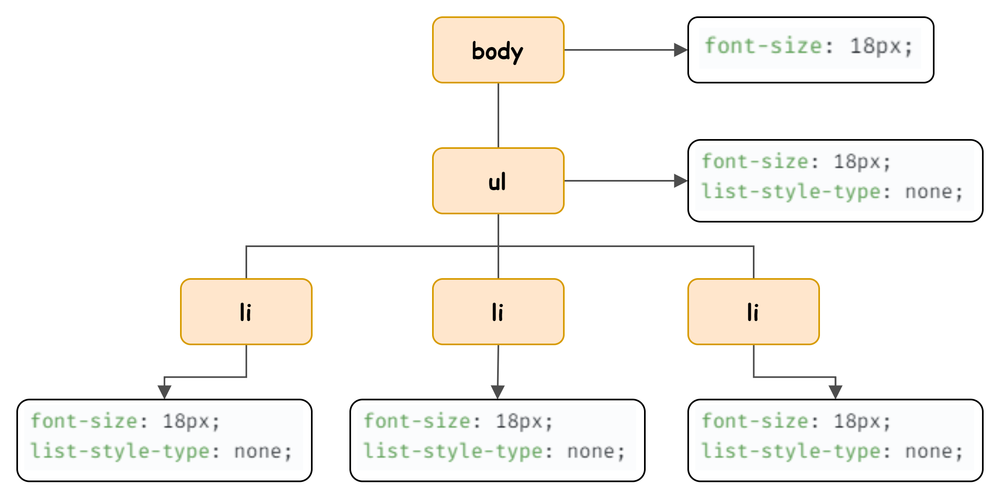

# 38. 브라우저 렌더링 과정

## 브라우저 렌더링 기본 용어
- 파싱(parsing)이란? 브라우저가 코드를 이해하고 사용할 수 있는 구조로 변환하는 것
## 요청과 응답
- HTML, CSS, JS, Image 등의 렌더링에 필요한 리소스를 요청하고 서버로부터 응답받고,
- 브라우저에 시각적으로 렌더링한다.
## HTTP 1.1과 HTTP 2.0

- 응답받은 HTML과 CSS를 파싱해 DOM과 CSSOM을 생성하고 이들을 결합해 렌더 트리를 생성한다.
- HTTP 2.0은 HTTP 1.1과 다르게 커넥션 당 여러 개의 요청과 응답(다중 요청/응답)이 가능하다.
## HTML 파싱과 DOM 생성
- 브라우저 렌더링 엔진은 응답받은 HTML 문서를 파싱하여 브라우저가 이해할 수 있는 자료구조인 DOM을 생성한다.
- 즉, DOM은 HTML 문서를 파싱한 결과물이다.

  - DOM tree의 진입점(Entry point)는 document 객체
  - 최종점은 요소의 텍스트를 나타내는 객체

## CSS 파싱과 CSSOM 생성
- 렌더링 엔진은 HTML과 동일한 해석과정(바이트→문자→토큰→노드→CSSOM)을 거쳐  
  CSS를 파싱해 CSSOM(CSS Object Model)을 생성
- style 태그 내의 CSS 또한 파싱하여 CSSOM을 생성

```html
<html>
  <head>
    <meta charset="UTF-8">
    <link rel="stylesheet" href="style.css">
...
```
```css
<!-- style.css -->

body {
  font-size: 18px;
}

ul {
  list-style-type: none;
}
```
## 렌더 트리 생성
- 렌더 트리 생성 과정

- 렌더 트리와 레이아웃/페인트


## 자바스크립트 파싱과 실행
- 브라우저 렌더링 엔진이 아닌, 자바스크립트 엔진이 처리함.
- 자바스크립트 엔진은 JS를 해석해 
  - AST(Abstract Syntax Tree)(아래 코드에서 2=>3번째)를 생성하고, 
  - AST를 기반으로 바이트 코드로 변환(아래 코드에서 3=>4번째)해 
  - 인터프리터에 의해 실행


## 리플로우(Reflow)와 리페인트(Repaint)
- 변경된 렌더트리를 기반으로 레이아웃 페인트 과정을 거쳐 브라우저 화면에 다시 렌더링 되는데  
  이를 리플로우, 리페인트라고 말한다.

- 리플로우: 레이아웃을 다시 계산하는 것
- 리페인트: 재결합된 렌더 트리를 기반으로 다시 페인트를 하는 것
- 레이아웃에 영향이 없는 변경은 리페인트만 실행된다.
## 자바스크립트 파싱에 의한 HTML 파싱 중단

- 자바스크립트 엔진은 직렬적으로 파싱을 수행함.
- 브라우저는 동기적/순차적으로 HTML, CSS, JS를 파싱하고 실행함
## script 태그의 async/defer 어트리뷰트

- async 어트리뷰트
  - 자바스크립트 파일의 로드가 완료가 진행된 직 후 HTML 파싱을 중단하고 진행되며,  
    async 태그 순서는 보장되지 않는다
- defer 어트리뷰트
  - HTML 파싱이 완료된 직후, 즉 DOM 생성이 완료된 직후에 자바스크립트 파싱과 실행이 진행된다.
  - DOM 생성이 완료된 이후 실행될 자바스크립트에 유용하다.
```Javascript
<script async src="extern.js"></script>
<script defer src="extern.js"></script>
```