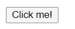
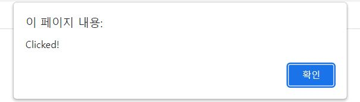

# 40. 이벤트
## 이벤트란? 
- 웹페이지에서 마우스를 클릭했을 때, 키를 입력했을 때,  
  특정요소에 포커스가 이동되었을 때 어떤 사건을 발생시키는 것 
```html
<!DOCTYPE html>
<html>
<body>
  <button class="myButton">Click me!</button>
  <script>
    document.querySelector('.myButton').addEventListener('click', function () {
      alert('Clicked!');
    });
  </script>
</body>
</html>
```


## 이벤트 드리븐 프로그래밍
- 프로그램의 흐름을 이벤트 중심으로 제어하는 프로그래밍 방식
## 이벤트 타입 (poiemaweb 기준으로 서술함)
### UI 이벤트
Event|Description|
:-:|:-:
load|웹페이지의 로드가 완료되었을 때
unload|웹페이지가 언로드될 때(주로 새로운 페이지를 요청한 경우)
error|브라우저가 자바스크립트 오류를 만났거나 요청한 자원이 존재하지 않는 경우
resize|브라우저 창의 크기를 조절했을 때
scroll|사용자가 페이지를 위아래로 스크롤할 때
select|텍스트를 선택했을 때

### 마우스 이벤트
|Event|Description|
|:-:|:-:|
|click|마우스 버튼을 클릭했을 때|
|dbclick|마우스 버튼을 더블 클릭했을 때|
|mousedown|마우스 버튼을 누르고 있을 때|
|mouseup|누르고 있던 마우스 버튼을 뗄 때|
|mousemove|마우스를 움직일 때 (터치스크린에서 동작하지 않는다)|
|mouseover|마우스를 요소 위로 움직였을 때 (터치스크린에서 동작하지 않는다)|
|mouseout|마우스를 요소 밖으로 움직였을 때 (터치스크린에서 동작하지 않는다)|

### 키보드 이벤트
|Event|Description|
|:-:|:-:|
keydown|키를 누르고 있을 때
keyup|누르고 있던 키를 뗄 때
keypress|키를 누르고 뗏을 때

### 포커스 이벤트
|Event|Description|
|:-:|:-:|
focus/focusin|요소가 포커스를 얻었을 때
blur/foucusout|요소가 포커스를 잃었을 때

### 폼 이벤트
|Event|Description|
|:-:|:-:|
input|input 또는 textarea 요소의 값이 변경되었을 때
contenteditable|어트리뷰트를 가진 요소의 값이 변경되었을 때
change|select box, checkbox, radio button의 상태가 변경되었을 때
submit|form을 submit할 때 (버튼 또는 키)
reset|reset 버튼을 클릭할 때 (최근에는 사용 안함)

## Clipboard 이벤트
|Event|Description|
|:-:|:-:|
cut|콘텐츠를 잘라내기할 때
copy|콘텐츠를 복사할 때
paste|콘텐츠를 붙여넣기할 때

## 이벤트 핸들러 등록
### 이벤트 핸들러 어트리뷰트 방식
```Javascript
<!DOCTYPE html>
<html>
<body>
  <button onclick = "sayHi('Yejin')">Click me!</button>
  <script>
    function sayHi(name) {
      console.log(`Hi! ${name}.`);
    }
  </script>
</body>
</html>
```
### 이벤트 핸들러 프로퍼티 방식

```Javascript
<!DOCTYPE html>
<html>
<body>
  <button>Click me!</button>
  <script>
    const $button = document.querySelector('button');

    // 이벤트 핸들러 프로퍼티에 이벤트 핸들러를 바인딩
    $button.onclick = function() { 
      console.log('button click'); 
    };
  </script>
</body>
</html>
```
### addEventListener 메서드 방식

```Javascript
<!DOCTYPE html>
<html>
<body>
  <button>Click me!</button>
  <script>
    const $button = document.querySelector('button');

    // addEventListener 방식
    $button.addEventListener('click', function() { 
      console.log('button click'); 
    });
  </script>
</body>
</html>
```
## 이벤트 핸들러 제거
- EventTarget.prototype.removeEventListener 메서드를 사용
```Javascript
<!DOCTYPE html>
<html>
<body>
  <button>Click me!</button>
  <script>
  const $button = document.querySelector('button');
  
  const handleClick = () => console.log('button click');

  // 이벤트 핸들러 등록
  $button.addEventListener('click', handleClick);

  // 이벤트 핸들러 제거
  // 전달한 인수가 일치하지 않으면 이벤트 핸들러가 제거되지 않는다.
  $button.removeEventListener('click', handleClick, true); // 실패
  $button.removeEventListener('click', handleClick); // 성공
  </script>
</body>
</html>
```
## 이벤트 객체
### 이벤트 객체의 상속 구조

- Object, Event 뿐 아니라 다양한 이벤트 관련 생성자 함수와 더불어 생성되는 프로토타입으로 구성된 프로토타입 체인의 일원
### 이벤트 객체의 공통 프로퍼티
- type
- target(이벤트를 발생시킨 DOM요소)
- currentTarget(이벤트 핸들러가 바인딩된 DOM요소)
- eventPhase
- bubbles
- cancelable
- defaultPrevented
- isTrusted
- timeStamp
### 마우스 정보 취득
- 마우스 포인터의 좌표 정보를 나타내는 프로퍼티
  - screenX/screenY
  - clientX/clientY
  - pageX/pageY
  - offsetX/offsetY
- 버튼 정보를 나타내는 프로퍼티
  - altKey
  - ctrlKey
  - shiftKey
  - button
### 키보드 정보 취득
- 프로퍼티
  - altKey
  - ctrlKey
  - shiftKey
  - metaKey
  - key
  - keyCode
## 이벤트 전파

- DOM 트리 상에 존재하는 DOM 요소 노드에서 발생한 이벤트가 DOM 트리를 통해 전파되는 것
## 이벤트 위임
```Javascript
function activate({target}) {
  if(!target.matches('#fruits > li')) return;
}
```
## DOM 요소의 기본 동작의 조작
### DOM 요소의 기본 동작 중단
- preventDefault 메서드
### 이벤트 전파 방지
- stopPropagation 메서드
## 이벤트 핸들러 내부의 this
### 이벤트 핸들러 어트리뷰트 방식
```Javascript
<!DOCTYPE html>
<html>
<body>
  <button onclick = "handleClick()">Click me!</button>
  <script>
    function handleClick() {
      console.log(this); // window
    }
  </script>
</body>
</html>
```
### 이벤트 핸들러 프로퍼티 방식과 addEventListener 메서드 방식
- 이벤트 핸들러 프로퍼티 방식
```Javascript
<!DOCTYPE html>
<html>
<body>
  <button class="btn">Button</button>
  <script>
    const btn = document.querySelector('.btn');

    btn.onclick = function (e) {
      console.log(this); // <button id="btn">Button</button>
      console.log(e.currentTarget); // <button id="btn">Button</button>
      console.log(this === e.currentTarget); // true
    };
  </script>
</body>
</html>
```
- addEventListener 메서드 방식
```Javascript
<!DOCTYPE html>
<html>
<body>
  <button class="btn">Button</button>
  <script>
    const btn = document.querySelector('.btn');

    btn.addEventListener('click', function (e) {
      console.log(this); // <button id="btn">Button</button>
      console.log(e.currentTarget); // <button id="btn">Button</button>
      console.log(this === e.currentTarget); // true
    });
  </script>
</body>
</html>
```
## 이벤트 핸들러에 인수 전달
- 이벤트 핸들러 내부에서 함수를 호출하면서 인수를 전달
```Javascript
const checkUserNameLength = min => {...}

$input.onblur = () => { checkUserNameLength(인수); }
```
- 또는 이벤트 핸들러를 반환하는 함수를 만들어 호출 하여 인수를 전달
```Javascript
const checkUserNameLength = min => e => {...}

$input.onblur = checkUserNameLength(인수);
```
## 커스텀 이벤트
### 커스텀 이벤트 생성
- 커스텀 이벤트: 개발자 의도로 생성된 이벤트
- 기존 이벤트 타입이 아닌 새로운 이벤트 타입도 가능한데,  
  CustomEvent 이벤트 생성자 함수를 사용
### 커스텀 이벤트 디스패치
- dispatchEvent 메서드
  - (디스패치: 이벤트를 발생시키는 행위)