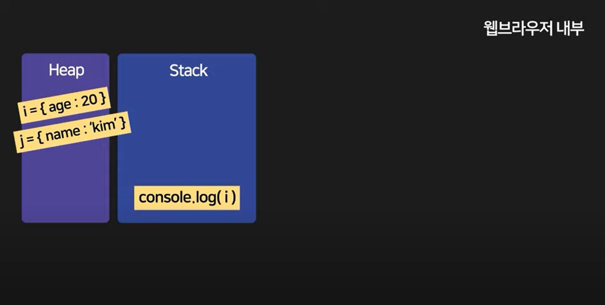

# 추가내용
> <b>앞 내용이 너무 지엽적이라 좀 더 쉽게 풀어서 써봤다.</b>
## [42] 브라우저 동작원리 (비동기 처리의 원리)
### [개발자 90%가 모르는 자바스크립트 동작원리 (Stack, Queue, event loop) (코딩 애플)](https://www.youtube.com/watch?v=v67LloZ1ieI)
### Heap - 변수를 저장하는 공간

### Stack - 엔진 실행 직전에 Heap, Event Queue에서 넘어온 코드가 담기는 공간

### Event Queue - 커널에서 대기끝난 코드들의 대기실 (Stack으로 가기 전 단계) 
### + (Queue에서 뺄 때, Stack이 비어있을 때만 함수를 올려보낸다)

- 참고로 대기 시간이 0초인 경우에도 바로 대기실로 직행하기에,  
  그 다음 코드가 먼저 실행된 후 해당 코드가 실행된다
---
## [42, 45] 태스크 큐 vs 마이크로태스크 큐
- 콜백함수를 태스크 큐에 넣는 함수
  - <b>setTimeout</b>, setInterval, setImmediate, requestAnimationFrame, I/O, UI 렌더링
- 콜백함수를 마이크로태스크 큐에 넣는 함수
  - <b>Promise</b>, process.nextTick, Object.observe, MutationObserver

> <b>처리 우선 순위 : 마이크로 태스크 큐 > 태스크 큐.  
> 마이크로 태스크 큐: 일반 테스크 보다 우선 순위가 높은 테스크</b>  
> 마이크로 테스크는 일반 테스크 큐에 저장되지 않고 마이크로 테스크 큐에 따로 저장
```Javascript
setTimeout(()=>console.log(1),0);
Promise.resolve()
  .then(()=>console.log(2))
  .then(()=>console.log(3));
  
// 태스크 큐에는 : 1 
// 마이크로태스크 큐에는 : 2,3 
// 우선순위 대로 2,3,1 출력
```
- Promise의 <b>then()</b> 메서드는 콜백을 마이크로 테스크 큐에 저장
- 후에 <b>setTimeOut()</b> 메서드 호출
---
## [43, 46] XMLHttpRequest VS Fetch
### [Ajax가 무엇인지 설명하는 영상 (+CORS, fetch 어쩌구) (코딩애플)](https://www.youtube.com/watch?v=nKD1atl6cAw)
---
## [45] API

> <b>API: 컴퓨터의 기능을 실행시키는 방법 </b>
### [코딩초보들이 헷갈리는 용어 : API가 뭐냐면 (코딩애플)](https://www.youtube.com/watch?v=ckSdPNKM2pY)
```Javascript
// API 예시
document.write('Helo World');
```
## [45] REST API
### 
> <b> REST API: 쉽게 말해, 남의 컴퓨터를 실행시키는 명령 </b>  
> 기계와 기계가 규격화된 방식으로 웹을 이용해 통신 할 수 있게 한 통신규칙
### [기계들의 대화법 - REST API (생활코딩)](https://www.youtube.com/watch?v=PmY3dWcCxXI)
```Javascript
HTTP POST, http://velog/io/
{
  "users": {
    "name": "yj0020"
    }
}
```