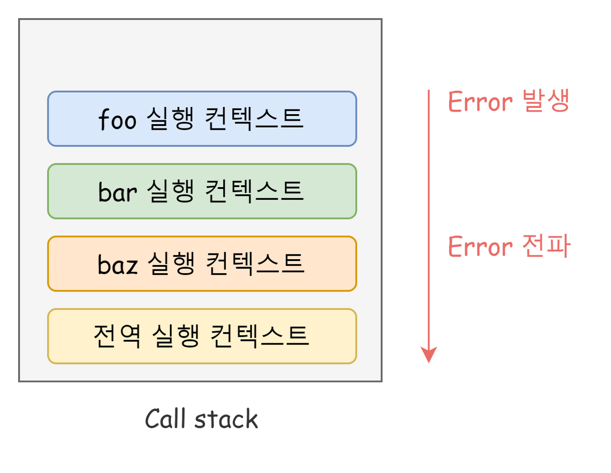

# 47. 에러 처리
## 에러 처리의 필요성
> <b>에러에 적절하게 대응하면 프로그램이 강제 종료되지 않고 계속해서 코드를 실행시킬 수 있다</b>

### 에러 처리를 하지 않은 경우
```Javascript
console.log('[Start]');

foo(); // ReferenceError: foo is not defined
// 발생한 에러를 방치하면 프로그램은 강제 종료된다.

// 에러에 의해 프로그램이 강제 종료되어 아래 코드는 실행되지 않는다.
console.log('[End]');
```
### 에러 처리를 진행한 경우
```Javascript
console.log('[Start]');

try {
  foo();
} catch (error) {
  console.error('[에러 발생]', error);
  // [에러 발생] ReferenceError: foo is not defined
}

// 발생한 에러에 적절한 대응을 하면 프로그램이 강제 종료되지 않는다.
console.log('[End]');
```
---
## 에러 처리하는 방법
### try... catch...finally 문
#### 예시
```Javascript
try{
  // 실행할 코드(에러가 발생할 가능성이 있는 코드)
} catch (err) {
  // try 코드 블록에서 에러가 발생하면 이 코드 블록의 코드가 실행된다.
  // err에는 try 코드 블록에서 발생한 Error 객체가 전달된다.
} finally {
  // 에러 발생과 상관없이 반드시 한 번 실행된다.  
}
```
### Error 객체
- Error 생성자 함수에는 에러를 상세히 설명하는 에러 메세지를 인수로 전달할 수 있다.
```Javascript
const error = new Error('invalid');
```
#### 자바스크립트의 7가지 에러 생성자 함수 
|생성자 함수|인스턴스|
|:-:|:-:|
|Error|일반적 에러 객체|
|SyntaxError|자바스크립트 문법에 맞지 않는 문을 해석할 때 발생하는 에러 객체|
|ReferenceError|참조할 수 없는 식별자를 참조했을 때 발생하는 에러 객체|
|TypeError|피연산자 또는 인수의 데이터 타입이 유효하지 않을 때 발생하는 에러 객체|
|RangeError|숫자값의 허용 범위를 벗어났을 때 발생하는 에러 객체|
|URIError|encodeURI 또는 decodeURI 함수에 부적절한 인수를 전달했을 때 발생하는 에러 객체|
|EvalError|eval 함수에서 발생하는 에러 객체|
### throw 문
> 에러 객체 생성과 에러 발생은 의미가 다르다.  
> 에러를 발생시키려면 try 코드 블록에서 throw 문으로 에러 객체를 던저야 한다.
```Javascript
try {
  // 에러 객체를 던지면 catch 코드 블록이 실행되기 시작한다.
  throw new Error('something wrong');
} catch (error) {
  console.log(error); // Error: something wrong
}
```
### 에러의 전파
> 에러는 호출자 방향으로 전파된다. 
- 콜 스택의 아래 방향(실행 중인 실행 컨텍스트가 푸시되기 직전에 푸시된 실행 컨텍스트 방향)으로 전파된다.
```Javascript
const foo = () => {
  throw Error('foo에서 발생한 에러'); // ④
};

const bar = () => {
  foo(); // ③
};

const baz = () => {
  bar(); // ②
};

try {
  baz(); // ①
} catch (err) {
  console.error(err);
}
```
- ①에서 baz 함수를 호출하면 
- ②에서 bar 함수가 호출되고 
- ③에서 foo함수가 호출되고 
- foo 함수는 ④에서 에러를 throw한다
> foo 함수가 throw한 에러는 다음과 같이 호출자에게 전파되어 전역에서 캐치된다.

