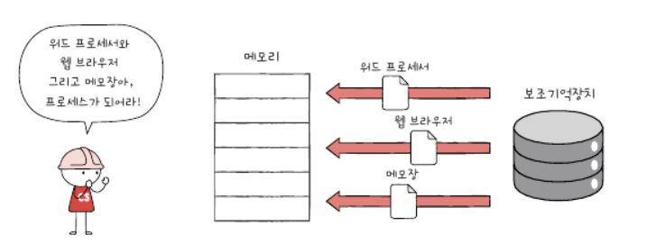
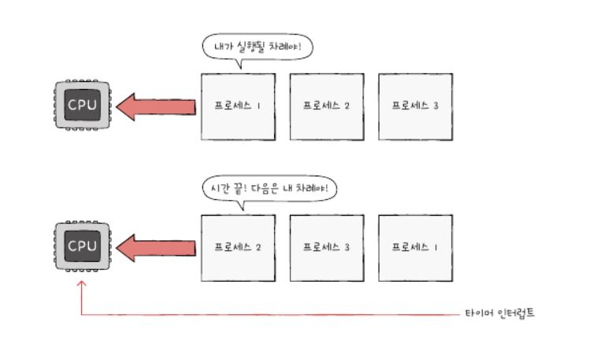
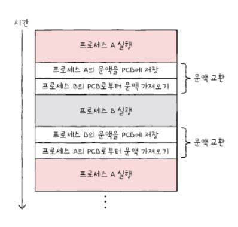
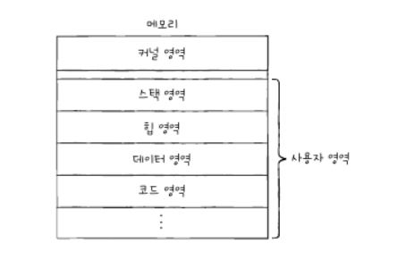
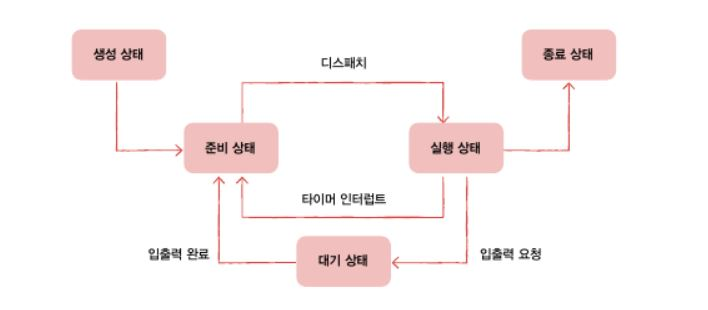
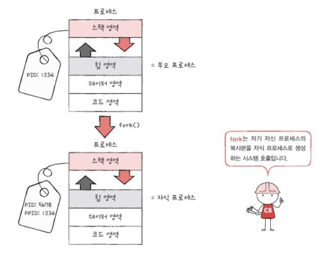
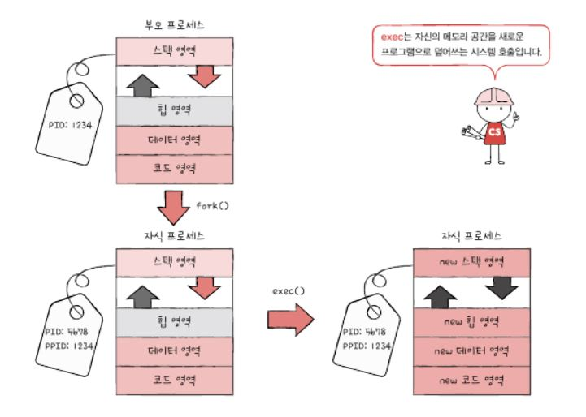
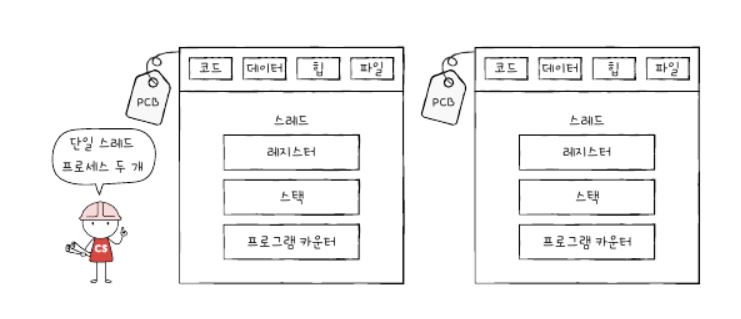
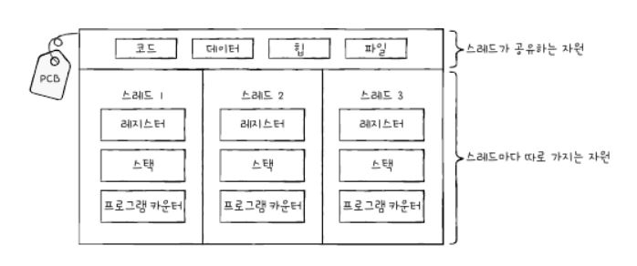

# 10. 프로세스와 스레드
## 프로세스 개요

> <b>프로세스: 현재 실행중인 프로그램</b>
- <b> 보조기억장치에 있는 데이터가 메모리에 적재되고 실행되는 순간 이 프로그램은 프로세스가 됨 </b>
- 포그라운드 프로세스
  - 사용자가 보는 앞에서 실행되는 프로세스
- 백그라운드 프로세스
  - 사용자가 보지 못하는 뒷편에서 실행되는 프로세스
### 프로세스 제어 블록
- <b>프로세스와 관련된 정보를 저장하는 자료구조</b>

- 운영체제는 프로세스의 실행 순서를 관리하고, 프로세스에 CPU를 비롯한 자원 배분
#### PCB에 담기는 정보
- 프로세스 ID
- 레지스터 값
- 프로세스 상태
- CPU 스케쥴링 정보
- 메모리 관리 정보
- 사용한 파일과 입출력장치 목록
### 문맥 교환
- 문맥: 하나의 프로세스 수행을 재개하기 위해 기억해야 할 정보

> 프로세스 간 실행을 전환하는 것
- 하나의 프로세스가 CPU를 사용 중인 상태에서 다른 프로세스가 CPU를 사용하도록 하기 위해,  
  이전의 프로세스의 상태(문맥)를 보관하고 새로운 프로세스의 상태를 적재하는 작업
### 프로세스 메모리 영역

- 코드 영역
  - 텍스트 영역
  - 데이터가 아닌 CPU가 실행할 명령어가 담김 (기계어로 이루어진 명령어가 저장됨)
  - 위에 따라, 읽기 전용
- 데이터 영역
  - 프로그램이 실행되는 동안 유지할 데이터
  - ex) 전역변수
  - 정적 할당 영역
- 힙 영역
  - 프로그래머가 직접 할당 가능한 메모리 공간
  - 메모리 누수 발생 가능성 존재
  - 동적 할당 영역
- 스택 영역
  - 데이터를 일시적으로 저장하는 공간
  - 동적 할당 영역

## 프로세스 상태와 계층 구조
### 프로세스 상태

- 생성
  - 프로세스 생성 중인 상태
- 준비 
  - 당장이라도 CPU를 할당받아 실행 가능하지만, 차례가 오지 않았기에 기다리는 상태
- 실행
  - CPU를 할당받아 실행 중인 상태
- 대기
  - (실행 도중 프로세스가 입출력장치를 사용하는 경우) 입출력장치의 작업을 기다리는 상태
- 종료
  - 프로세스가 종료된 상태.
  - 운영체제는 PCB와 프로세스가 사용한 메모리를 정리함.

### 부모 프로세스와 자식 프로세스
- 부모 프로세스
  - 새 프로세스를 생성한 프로세스
- 자식 프로세스
  - 부모 프로세스에 의해 생성된 프로세스

### 프로세스 생성 기법
- fork

- exec

## 스레드
> 프로세스를 구성하는 실행 단위

### 멀티스레드
> 여러 스레드로 프로세스를 동시에 실행하는 것

- 협력과 통신에 유리하고 메모리 효율적으로 사용 가능
- 각기 다른 레지스터 값, 스택, 프로그램 카운터 값을 가지지만  
  동일한 주소 공간의 코드, 데이터, 힙 영역, 열린 파일과 같은 같은 프로세스 자원을 공유함.  
  한 PCB 안에 존재
- 하나의 스레드의 문제가 전체 문제가 될 수 있음

### 멀티프로세스
> 여러 프로세스를 동시에 실행하는 것
- 동일한 프로세스 두 개 동시에 실행하면 모든 자원이 복제되어 메모리에 적재됨
### 멀티스레드와 멀티프로세스의 차이
- 프로세스끼리는 서로 자원을 공유하지 않으나,  
  스레드끼리는 위 그림처럼 같은 프로세스의 자원을 공유함