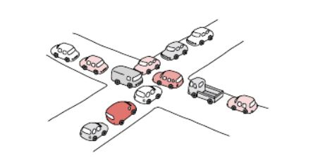
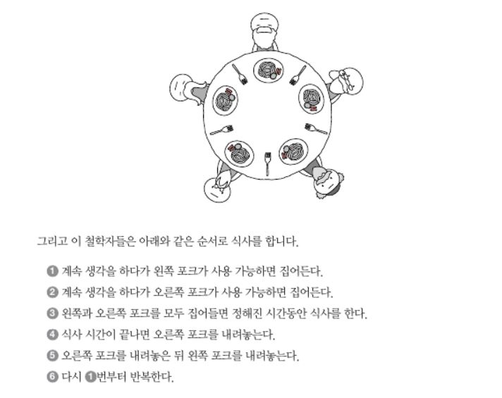
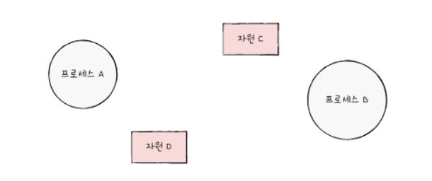
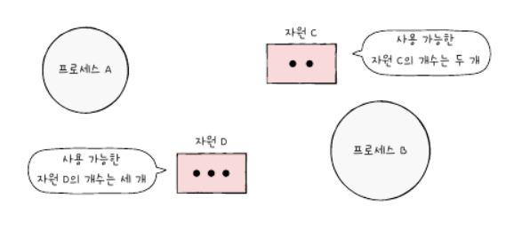
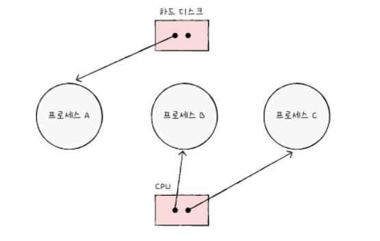
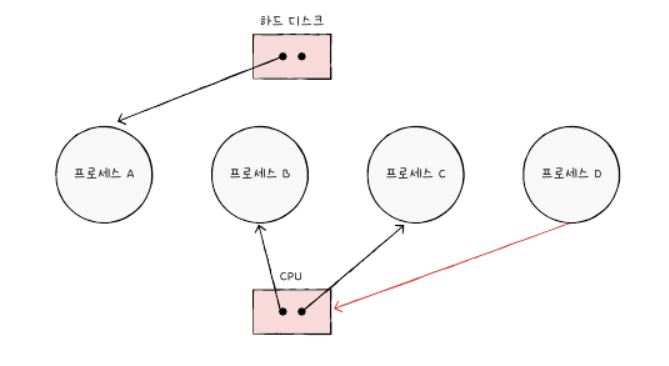

# 13. 교착 상태
## 교착 상태란
> <b>일어나지 않을 사건을 기다리며 무한히 대기하는 현상</b>
- 도심 교통체증 현상 생각해면 이해 쉬움
  - 교통 마비 시 복구까지 오랜 시간이 걸리고, 심한 경우 경찰이 와서 마비를 해결해야 함

### 식사하는 철학자 문제
- 교착 상태의 발생을 보여주는 예시  
(두 개의 포크로 먹어야 하는 수 있는 음식)

> 해당 상황에서 모든 철학자가 동시에 왼쪽 포크를 들면 교착 상태 발생
### 자원 할당 그래프
- 이를 이용해 교착 상태 표현 가능
1. 프로세스는 원으로, 자원의 종류는 사각형으로 표현한다.

2. 사용할 수 있는 자원의 개수는 자원 사각형 내에 점으로 표현한다.

3. 프로세스가 어떤 자원을 할당받아 사용 중이라면 자원에서 프로세스를 향해 화살표를 표시합니다.

4. 프로세스가 어떤 자원을 기다리고 있다면 프로세스에서 자원으로 화살표를 표시합니다.
   
### 교착 상태 발생 조건
- 상호 배제
  - 해당 자원을 하나의 프로세스만 이용 가능함
- 점유와 대기 
  - 자원을 할당받은 상태에서 다른 자원을 할당받기 기다리는 상태
- 비선점
  - 어떤 프로세스도 다른 프로세스의 자원을 강제로 빼앗지 못 함
- 원형 대기
  - 프로세스와 자원이 원의 형태로 대기하기에 발생하는 문제

## 교착 상태 해결 방법
### 교착 상태 예방
> <b>교착 상태의 발생 조건 중 하나를 충족하지 못하게 하는 방법</b>  
> 아래 4가지 중 하나의 조건을 없애는 것
- 상호 배제
  - 모든 자원을 공유 가능하게 한다.
  - 현실에서 사용하기에는 무리
- 점유와 대기
  - 특정 프로세스에 자원을 모두 할당하거나 아예 할당하지 않는 방식
  - 자원의 활용률이 낮아질 가능성 존재
- 비선점
  - 이용 중인 프로세스로부터 해당 자원을 빼앗을 수 있음.
- 원형 대기
  - 모든 자원에 번호를 붙이고, 오름차순으로 자원 할당
> 컴퓨터 시스템 내에 존재하는 수많은 자원에 번호를 붙이기 쉽지 않음  
> 번호 순서에 따라 특정 자원의 활용률이 떨어질 가능성 존재
### 교착 상태 회피
> 안전 상태를 유지 가능한 경우에만 자원을 할당하는 방법
- 안전 상태: 교착 상태 없이 안전하게 프로세스들에 자원을 할당할 수 있는 상태
  - 안전 순서열: 안전하게 프로세스들에 자원을 할당할 수 있는 순서
- 불안전 상태: 안전 순서열이 없는 상태
### 교착 상태 검출 후 회복
> 교착 상태 발생 여부를 주기적으로 검사하고,  
  교착 상태 발생 시 그때그때 회복하는 방식
- 선점을 통한 회복
  - 교착 상태 해결될 때까지 한 프로세스의 자원을 몰아주는 방식
- 프로세스 강제 종료를 통한 회복
  - 교착 상태가 없어질 때까지 한 프로세스씩 강제 종료